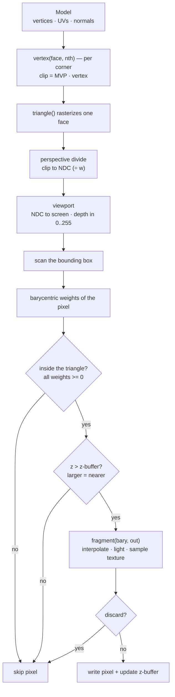
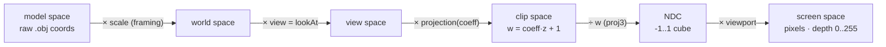
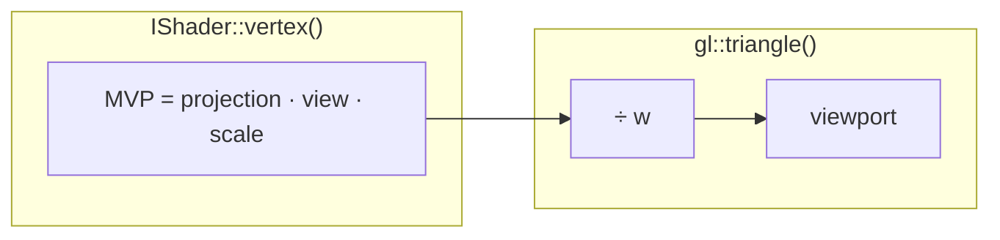
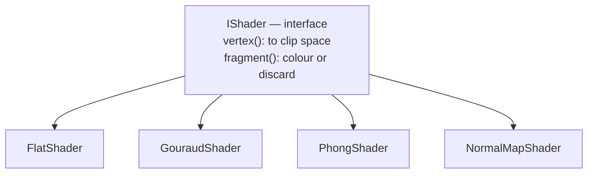
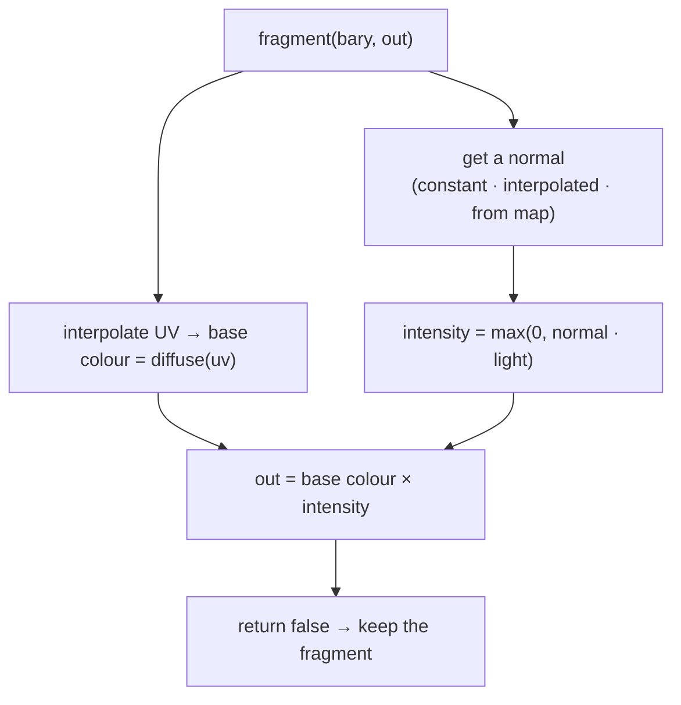

# The rendering pipeline (illustrated)

How this renderer turns a list of triangles into a shaded image, stage by stage.
The diagrams below render on GitHub (Mermaid). This guide is our own; two other
excellent treatments of the same ideas are
[haqr.eu/tinyrenderer](https://haqr.eu/tinyrenderer/) and
[ssloy/tinyrenderer](https://github.com/ssloy/tinyrenderer) — worth reading
alongside it.

Everything here is a CPU stand-in for what a GPU does in hardware. There are no
libraries: `Image` is an array of pixels, `triangle()` is the rasterizer, and an
`IShader` plays the role of the programmable vertex/fragment shaders.

---

## The whole pipeline at a glance



The driver loop is tiny — the shader and the rasterizer do the work:

```mermaid
flowchart TD
    LOOP["for each face f in the model"] --> Vtx["clip[0..2] = shader.vertex(f, 0..2)"]
    Vtx --> T["triangle(clip, shader, img, zbuf)"]
    T --> LOOP
    LOOP --> OUT["img.writePPM(\"render.ppm\")"]
```

---

## Coordinate spaces: where every vertex travels

A vertex starts as raw model coordinates and ends as a pixel. Each arrow is a
matrix multiply (or the perspective divide):



**Who does what here — a convention worth pinning down:**

- `vertex()` returns **clip space** — it applies `MVP = projection · view · scale`
  and stops. It does **not** apply the viewport.
- `triangle()` owns the **last two steps**: the perspective divide (`proj3`) and
  the `viewport`. Folding the viewport into the shader's matrix would apply the
  screen mapping twice.



Three more conventions this codebase commits to (they trip everyone up once):

| Convention | Why |
|---|---|
| **Matrices are row-major**; a point is `M · v`. | Matches how `geometry.hpp` stores and multiplies. |
| **`viewport` folds in the Y-flip** (negated y-scale). | `Image` is row-major, origin top-left; NDC is +y-up. So NDC y=+1 lands on the *top* row — callers never flip anything. |
| **Depth is `[0,255]`, larger = nearer**; the test is `z > zbuf`. | One consistent "bigger wins" rule for the z-buffer; the depth range doubles as a writable grey value. |
| **Normals are read raw** (model space == world space). | Only the *camera* moves (`view`); the model is never transformed, so model-space normals are already world-space. Pushing them through the MVP (which carries translation + the perspective term) would be wrong. |

---

## Stage by stage

The finished code was built one stage at a time — that's also the order to read
it. Each stage compiles, runs, and shows visible progress.

1. **Framebuffer + PPM** (`image.{hpp,cpp}`). An image is an array of pixels you
   can `set()` and save as a binary `P6` PPM. Everything downstream just writes
   pixels here.
2. **Line — Bresenham** (`drawLine`). Integer-only line drawing; steep lines are
   transposed so we always step along the major axis. Draw three lines → a
   wireframe triangle.
3. **Triangle + barycentric** (`barycentric`, `triangle`). For each pixel in the
   triangle's bounding box, compute barycentric weights; the pixel is inside iff
   all three are `>= 0`. Those same weights interpolate everything else (depth,
   UV, normals).
4. **Z-buffer** (`zbuf` in `triangle`). Interpolate a depth per pixel; keep the
   fragment only if it is nearer than what's already there (`z > zbuf[idx]`).
   Two overlapping triangles now occlude correctly.
5. **Model** (`model.{hpp,cpp}`). A procedural cube/sphere or an OBJ loader; the
   renderer just asks for `vert/uv/normal(face, nth)`.
6. **Texture mapping** (`Model::diffuse(uv)`). Interpolate UV across the
   triangle and sample the diffuse texture (a checkerboard by default).
7. **Perspective + camera** (`projection`, `lookAt`). `projection(coeff)` sets
   `w = coeff·z + 1` so the later `÷ w` shrinks distant geometry; `lookAt` builds
   the view matrix from `eye/center/up`.
8. **Shaders** (`shader.{hpp,cpp}`). The `IShader` split (below) lets you swap
   Flat / Gouraud / Phong without touching the rasterizer.
9. **Tangent-space normal mapping** (`NormalMapShader`). Per-pixel normals read
   from a texture in *tangent space*, rotated into world space by a per-triangle
   TBN basis built from the edge vectors and UV gradients.

---

## The shader interface

`triangle()` is generic — it knows nothing about lighting or textures. It drives
an `IShader`: `vertex()` once per corner (transform + stash "varyings"), then
`fragment()` per covered pixel (interpolate the varyings, compute the colour, or
discard).



The four shaders differ only in **where** the lighting is computed — the same
axis GPUs trade off to this day:

| Shader | Lighting computed | Result |
|---|---|---|
| **Flat** | once per **face** (constant) | visible facet edges on low-poly meshes |
| **Gouraud** | per **vertex**, interpolated | smooth, but highlights can fall between vertices |
| **Phong** | per **pixel** (interpolate the normal, then light) | smoothest; correct highlights |
| **NormalMap** | per **pixel**, normal from a texture (tangent space → world via TBN) | fine surface detail independent of geometry |



---

## See it — generate the images yourself

The pictures for this renderer are its own output (no external images needed):

```sh
# default: procedural cube, checkerboard, normal-map shader
make run-cpp-app-63-renderer                     # writes render.ppm here

# a real model + textures (see assets/tinyrenderer/README.md for the full arg list)
make run-cpp-app-63-renderer ARGS="assets/tinyrenderer/african_head/african_head.obj phong \
  assets/tinyrenderer/african_head/african_head_diffuse.ppm \
  assets/tinyrenderer/african_head/african_head_nm_tangent.ppm"
```

View `render.ppm` in a PPM-capable viewer, or convert it:

```sh
magick render.ppm render.png        # ImageMagick
# or: pnmtopng render.ppm > render.png
```

Try `flat` / `gouraud` / `phong` / `normal` as the shader argument, and `cube` /
`sphere` / a `.obj` as the model, to *see* each stage's effect.

---

## Going further

haqr's course continues past where this renderer stops — natural next projects:

- **Shadow mapping** — render depth from the light's viewpoint, then test against
  it in a second pass.
- **Ambient occlusion (SSAO)** — darken creases using nearby depth.
- **Toon shading** — quantise the lighting for a stylised look.

These reuse everything above: a framebuffer, the z-buffer, and a shader.

## References
- [haqr.eu/tinyrenderer](https://haqr.eu/tinyrenderer/) — a well-illustrated course.
- [ssloy/tinyrenderer wiki](https://github.com/ssloy/tinyrenderer/wiki) — the original series this capstone is modelled on.
